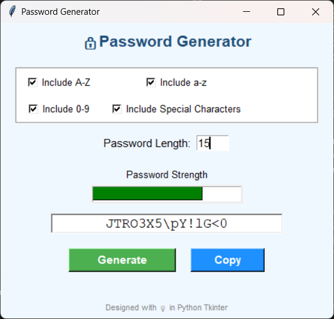
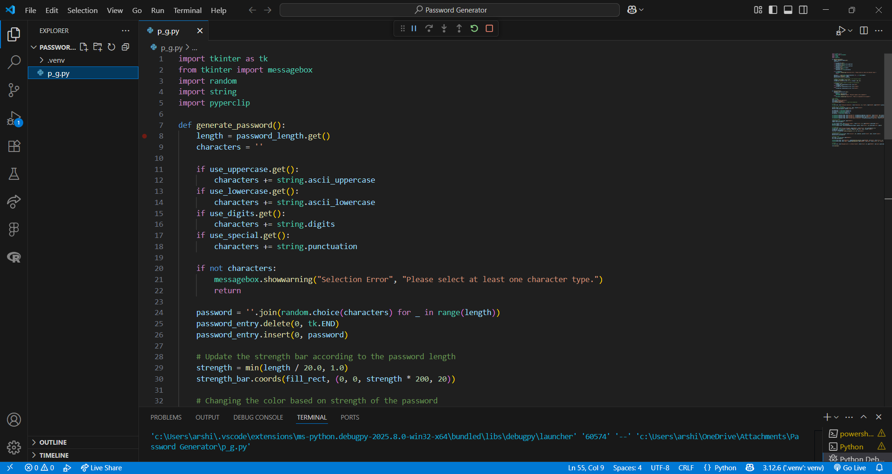

# 🔐 Secure Password Generator (Tkinter GUI)

A simple and user-friendly desktop application built using Python's Tkinter module. This tool allows users to generate secure and customizable passwords with options for length and character types. The generated password strength is visualized using a dynamic strength bar.

---

## Features

- ✅ Choose from uppercase, lowercase, digits, and special characters 
- ✅ Set custom password length 
- ✅ Visual password strength bar (color-coded) 
- ✅ One-click password generation 
- ✅ Copy password to clipboard 
- ✅ Clean and attractive UI using Tkinter

---

## Result Preview

Below is a screenshot of the application interface:



---

## How to Run

1. Make sure Python is installed:
   ```bash
   python --version
2. Install the required Libraries:
   ```bash
   pip install piperclip
3. Run the Script:
   ```bash
   python p_g.py

## Project Structure

/Password Generator/
|
|----password_generato.py
|----result.png
|----README.md

## Platform Used

* Visual Studio Code

  
  

## Technologies Used

* Python 3.12.6
* TKInter (GUI)
* Pyperclip (Clipboard Copy Support)
  
## Author

Arshiya M. Saiyyad
   
   

